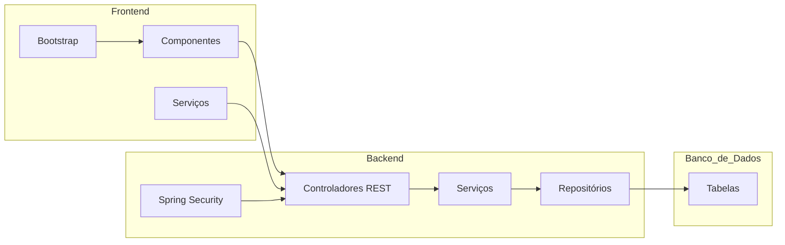
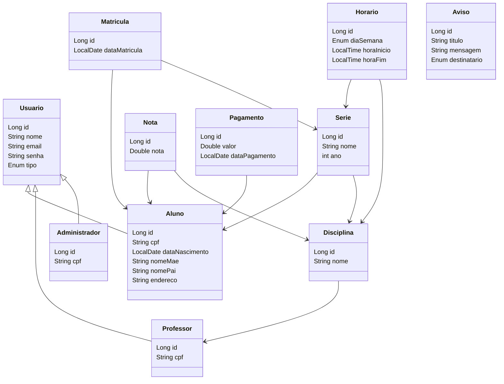

# Escola
projeto para prototipo de site escolar com intuito de aprendizado em angular e Java

``` mermaid
graph LR
    subgraph Frontend
        componentes[Componentes]
        servicos[Serviços]
        bootstrap[Bootstrap]
    end

    subgraph Backend
        controladores[Controladores REST]
        servicosBackend[Serviços]
        repositorios[Repositórios]
        springSecurity[Spring Security]
    end

    subgraph Banco_de_Dados
        tabelas[Tabelas]
    end

    componentes --> controladores
    servicos --> controladores
    bootstrap --> componentes

    controladores --> servicosBackend
    servicosBackend --> repositorios
    repositorios --> tabelas
    springSecurity --> controladores

```
# modelos de dados

```mermaid

classDiagram
    Usuario <|-- Aluno
    Usuario <|-- Professor
    Usuario <|-- Administrador
    Serie --> Aluno
    Serie --> Disciplina
    Disciplina --> Professor
    Matricula --> Aluno
    Matricula --> Serie
    Nota --> Aluno
    Nota --> Disciplina
    Horario --> Serie
    Horario --> Disciplina
    Pagamento --> Aluno

    class Usuario {
        Long id
        String nome
        String email
        String senha
        Enum tipo
    }
    class Aluno {
        Long id
        String cpf
        LocalDate dataNascimento
        String nomeMae
        String nomePai
        String endereco
    }
    class Professor {
        Long id
        String cpf
    }
    class Administrador {
        Long id
        String cpf
    }
    class Serie {
        Long id
        String nome
        int ano
    }
    class Disciplina {
        Long id
        String nome
    }
    class Matricula {
        Long id
        LocalDate dataMatricula
    }
    class Nota {
        Long id
        Double nota
    }
    class Horario {
        Long id
        Enum diaSemana
        LocalTime horaInicio
        LocalTime horaFim
    }
    class Pagamento {
        Long id
        Double valor
        LocalDate dataPagamento
    }
    class Aviso {
        Long id
        String titulo
        String mensagem
        Enum destinatario
    }


```
