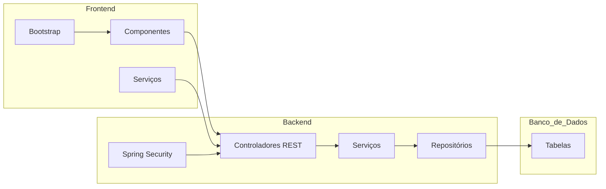
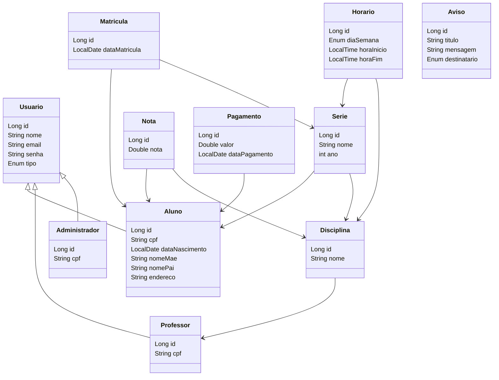

🏫 Sistema Escolar - Projeto
🌟 Funcionalidades Principais:
Gestão de Usuários: Cadastro, autenticação e gestão de perfis (alunos, professores, administradores).

Gestão de Séries: Criar, editar e deletar séries (maternal a 9º ano).

Matrículas: Matricular alunos em séries.

Notas: Inserir e visualizar notas dos alunos.

Horários: Criar e gerenciar horários de aulas.

Relatórios: Geração de relatórios de desempenho e frequência.

Pagamentos: Gerenciar pagamentos de mensalidades.

Avisos: Administradores ou professores podem postar avisos para turmas específicas.

🗂️ Arquitetura do Sistema:
Backend: Spring Boot para a lógica de negócios e API RESTful.

Frontend: Angular 17.1 para a interface do usuário, utilizando Bootstrap para o design responsivo.

Banco de Dados: PostgreSQL para armazenamento persistente de dados.

Segurança: Spring Security para autenticação e autorização.

📊 Entidades e DTOs:
Entidades:
Usuário: id, nome, email, senha, tipo

Aluno: cpf, dataNascimento, nomeMae, nomePai, endereco, serie

Professor: cpf, disciplinas

Administrador: cpf

Serie: id, nome, ano, alunos, disciplinas

Disciplina: id, nome, serie, professores

Matricula: id, aluno, serie, dataMatricula

Nota: id, aluno, disciplina, nota

Horario: id, serie, diaSemana, horaInicio, horaFim, disciplina

Pagamento: id, aluno, valor, dataPagamento

Aviso: id, titulo, mensagem, destinatario

DTOs:
AlunoDTO: id, nome, cpf, nomeMae, nomePai, endereco, dataNascimento, serieId

ProfessorDTO: id, nome, cpf, email

AdministradorDTO: id, nome, cpf, email

LoginDTO: email, senha

# modelos de dados

